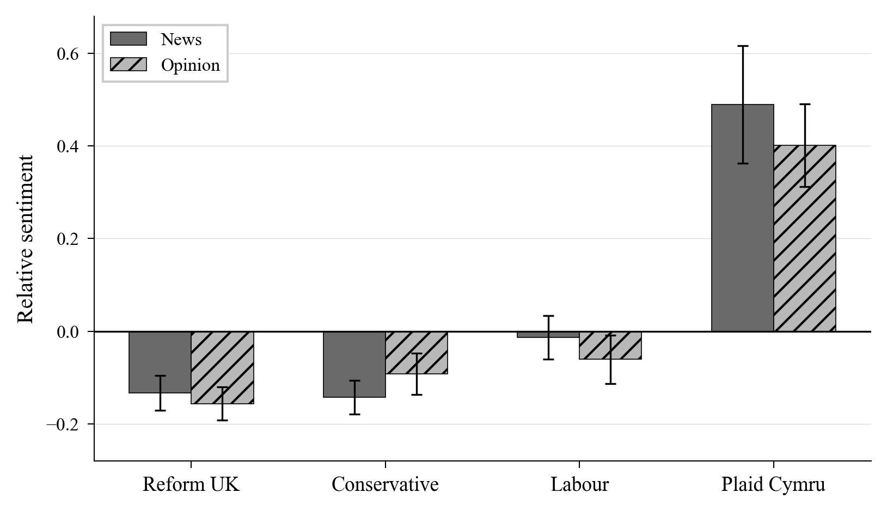

# Does Welsh Media Need a Review?

**Detecting Bias in Nation.Cymru’s Political Reporting**

Cai Parry-Jones · D200 Machine Learning in Economics · University of Cambridge · March 2026

---

## Background

The run-up to the 2026 Senedd election has seen growing accusations of political bias in Welsh media. Reform UK has [called for a review](https://www.bbc.co.uk/news/articles/cx2el7z2gypo) into the relationship between the BBC and Plaid Cymru, while a Conservative MS (later defected to Reform UK) has [raised concerns](https://nation.cymru/news/tory-ms-raises-concerns-over-impartial-media-coverage-of-senedd-election/) over the impartiality of coverage ahead of the vote. This project uses machine learning text analysis to examine political bias in Nation.Cymru, an award-winning news outlet with an accessible API archive. The key reason for this research is to determine whether a deeper bias review is required in Welsh political reporting.

---

## TL;DR

Nation.Cymru exhibits statistically significant differential sentiment bias across Welsh political parties. The primary analysis finds Reform UK attracts on-target biased framing at **twice the rate** of Plaid Cymru and over **three times the mean negative sentiment** (*p* < 0.001). However, the secondary analysis reveals that **Plaid Cymru is the outlier**, receiving markedly more favourable framing than any other party in both news and opinion articles, while Reform UK, the Conservatives, and Labour all cluster below the article-type mean.



*Mean on-target sentiment relative to article-type baseline (news and opinion). Error bars show 95% confidence intervals.*

For the full write-up, including methodology, and discussion of limitations, see [`report/report.tex`](report/report.tex).

---

## How It Works

The pipeline has two ML stages:

1. **Bias detection** — A RoBERTa model ([himel7/bias-detector](https://huggingface.co/himel7/bias-detector)) classifies whether the language surrounding each party mention is biased.
2. **LLM sentiment attribution** — Claude Sonnet 4.6 determines whether detected bias is *directed at* the named party (vs. the party merely being the speaker), assigns a sentiment score, and provides reasoning.

This two-stage cascade keeps costs low while handling the nuanced speaker-vs-target distinction that simpler models struggle with.

---

## Repo Structure

```
├── scripts/
│   ├── scrape.py                # Collect articles via Nation.Cymru's WordPress API
│   ├── preprocess.py            # Extract party mentions with context windows
│   ├── analyse.py               # Primary analysis: Reform UK vs Plaid Cymru
│   ├── analyse_secondary.py     # Secondary analysis: 4 parties, news vs opinion
│   ├── ml_utils.py              # Shared ML pipeline (bias detector + LLM classification)
│   ├── visualise.py             # Generate the sentiment bar chart
│   ├── tune_context_window.py   # Context window size experiment
│   ├── quick_data_check.py      # Print mention counts for the report
│   └── show_examples.py         # Display example biased sentences
├── report/
│   ├── report.tex               # Project report
│   ├── references.bib           # Bibliography
│   ├── figures/                 # Generated figures (e.g. sentiment_bars.pdf)
│   └── style/                   # ICML 2025 LaTeX style files
├── support_docs/                # Background material and project brief
├── data/                        # Generated data
├── requirements.txt
└── .gitignore
```

---

## Reproducing Results

### Prerequisites

- Python 3.10+
- **An Anthropic API key**: Stage 2 uses the Claude API for sentiment attribution. You'll need to create an account and generate a key at [console.anthropic.com](https://console.anthropic.com/). Total API cost is roughly **$11** (~$6 for the primary analysis, ~$5 for the secondary). The secondary analysis caps LLM classification at 250 randomly sampled biased mentions per party per article type to control costs.

### Setup

```bash
pip install -r requirements.txt
export ANTHROPIC_API_KEY='your-key-here'
```

### Run the full pipeline

```bash
# 1. Scrape articles from Nation.Cymru (11,847 articles)
python scripts/scrape.py

# 2. Extract party mentions with context windows
python scripts/preprocess.py

# 3. Primary analysis: Reform UK vs Plaid Cymru
python scripts/analyse.py

# 4. Secondary analysis: all parties, news vs opinion
python scripts/analyse_secondary.py

# 5. Generate the bar chart figure
python scripts/visualise.py
```

Each analysis script can also run individual stages with `--bias`, `--llm`, or `--analyse` flags. The LLM stage saves partial results, so interrupted runs can be resumed.

### Note on replication

LLM outputs are stochastic, exact numbers will vary slightly between runs, but replications show the overall patterns still holds.